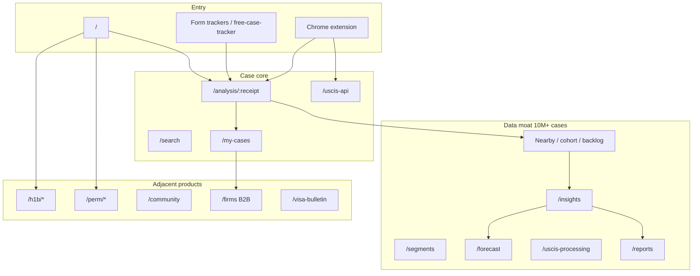

# MyCasesHub — Full Page & Feature Inventory

Source: live site as of Jul 26, 2026 — Vue SPA routes extracted from `/assets/index-*.js`, plus [sitemap-static.xml](https://mycaseshub.com/sitemap-static.xml), [reports sitemap](https://api.mycaseshub.com/reports/sitemap.xml) (~81 URLs), [H-1B sitemap](https://api.mycaseshub.com/h1b/sitemap.xml) (~509 URLs), [llms.txt](https://mycaseshub.com/llms.txt), and key marketing pages.

Stack signals: Vue + Pinia + Vue Router, Google Identity, Paddle billing, AWS WAF bot control, EN/ES (`?lang=es`), PWA manifest, companion Chrome extension, API host `api.mycaseshub.com`.

---

## A. All app routes (Vue Router)

### Core product

| Route | Purpose |
|-------|---------|
| `/` | Home / case lookup entry |
| `/analysis/:caseNumber` | Per-receipt case analysis (status, timeline, nearby stats) |
| `/search` | Case search (receipt / filtered search; plan-gated quotas) |
| `/my-cases` | Saved/tracked cases dashboard |
| `/forecast` | Approval Line Forecast (“where you sit in line”) |
| `/insights` | Aggregate USCIS insights & statistics hub |
| `/segments` | Cohort/segment outcomes explorer |
| `/uscis-activity` | USCIS daily activity monitor |
| `/uscis-processing` | Processing Activity Monitor (volume, treemap, day-of-week, etc.) |
| `/uscis-api` | Paste/decode my.uscis.gov API JSON |
| `/visa-bulletin` | Visa bulletin viewer/history |
| `/status` | Status explainer hub |
| `/status/:form/:slug` | Per-form status guide + live counts |

### SEO / form-specific trackers (landing pages)

| Route |
|-------|
| `/free-case-tracker` |
| `/i485-tracker`, `/i130-tracker`, `/i140-tracker`, `/i765-tracker`, `/n400-tracker` |
| `/h1b-tracker`, `/h4-ead-tracker`, `/green-card-tracker`, `/daca-tracker` |

### Approval Trends Brief (editorial)

| Route | Purpose |
|-------|---------|
| `/reports` | Newspaper-style index |
| `/reports/:form` | Latest issue for a form |
| `/reports/:form/:issueId` | Specific weekly issue (`{form}-{year}-w{week}`) |
| `/reports/methodology` | Methodology |

Forms covered in reports sitemap: I-90, I-129, I-129F, I-130, I-131, I-140, I-360, I-485, I-539, I-751, I-765, I-821, I-821D, N-400, N-600 (~81 published issue URLs currently).

### H-1B Data Hub

| Route | Purpose |
|-------|---------|
| `/h1b` | Hub home |
| `/h1b/top-sponsors` | Ranked sponsors |
| `/h1b/sponsors/:slug` | Sponsor profile (~200 in sitemap) |
| `/h1b/jobs`, `/h1b/jobs/:slug` | Occupations (SOC) |
| `/h1b/cities`, `/h1b/cities/:slug` | Metro areas |
| `/h1b/compare` | Side-by-side sponsors |
| `/h1b/lottery` | FY lottery odds calculator |
| `/h1b/prevailing-wage` | DOL levels by metro |
| `/h1b/salaries` | Salary lookup |
| `/h1b/wage-map` | Wage map |
| `/h1b/methodology` | Data methodology |

### PERM / DOL

| Route | Purpose |
|-------|---------|
| `/perm` | PERM/PWD/LCA case status lookup (FLAG) |
| `/perm/statistics` | PERM stats |
| `/perm/top-sponsors` | Top PERM sponsors |

### Community

| Route | Purpose |
|-------|---------|
| `/community` | Community hub |
| `/community/search` | Search posts |
| `/community/notifications` | Community notifications |
| `/community/post/:postId` | Post detail |
| `/hub/:hubName`, `/hub/:hubName/info` | Topic hubs by case type / topic |
| `/user/:userId` | Public user profile |

### Account / billing / auth

| Route | Purpose |
|-------|---------|
| `/account` | Account |
| `/profile`, `/profile/edit` | Profile |
| `/settings` | Settings (incl. notifications) |
| `/pricing` | Consumer pricing |
| `/pay` | Checkout (Paddle) |
| `/billing/success` | Post-checkout |
| `/auth/google/callback` | Google OAuth return |
| `/firms` | Law-firm product / pricing |
| `/help` | Help center |
| `/contact-us` | Contact |
| `/privacy-policy`, `/terms-of-service` | Legal |

### Easter-egg / games (in router, not core product)

`/game`, `/game/2048`, `/game/billiards`, `/game/breakout`, `/game/flappy`, `/game/minesweeper`, `/game/snake`, `/game/sudoku`, `/game/suika`, `/game/tetris`

### Catch-all

`/:pathMatch(.*)*` — 404

---

## B. Sitemap-indexed status explainer pages

Static sitemap includes `/status/{form}/{slug}/` for at least:

- **Forms:** I-485, I-765, I-130, I-131, I-90, N-400
- **Common slugs:** `case-received`, `actively-reviewed`, `still-processing`, `biometrics`, `fingerprints-taken`, `rfe-sent`, `rfe-response-received`, `noid`, `interview-scheduled`, `interview-cancelled`, `approved`, `denied`, `card-producing`, `card-delivered`, plus `transferred` on some forms

---

## C. Feature inventory (by product area)

### 1. Case lookup & analysis (`/`, `/analysis/:caseNumber`)

- Instant receipt-number lookup (no account required for basic lookup)
- Live / daily-refreshed USCIS status
- Case timeline / history
- **Nearby-case analysis** (200–1,000 neighbors by receipt proximity + same service center) — processing-time predictions, approval rates, stats
- Backlog by filing month
- Weekly approval-trend context
- Historical next-steps
- Cohort analysis (approval rates, timelines, position among similar cases)
- Case Flow Benchmark (step-by-step USCIS path + typical timing)
- Analysis stats APIs: summary, status distribution, decision distribution/rates, monthly flow, center times
- Case refresh / re-check
- “Add to My Cases” + alert opt-in
- Bilingual EN/ES

### 2. Case search (`/search`)

- Multi-page case search with filters
- Daily search quotas by plan (Free: 1/day first page; Lite: 10/day up to 10 pages; Premium: unlimited)
- Export with quota (`/open/search/export/quota`)

### 3. My Cases / tracking (`/my-cases`)

- Register & track multiple cases (plan caps: Free 3, Lite 10, Premium 100)
- Real-time / regular status-change alerts (plan-capped alert slots)
- Per-case metadata: field office, category, nationality
- Dashboard pulse (`/user/dashboard/pulse`)
- Bulk register, import, export
- Visa-bulletin linkage for tracked cases
- Notification settings

### 4. Insights hub (`/insights`)

Documented UI + API surface:

- Receipt-number structure / key terms glossary
- Status explainer picker (form + status → meaning + live counts)
- **How Busy Is USCIS?** — daily activity bars (approvals/denials/RFEs by day, filterable by type / service center / center type)
- **Today’s Lucky Ones / Unlucky Ones / RFE Ones** — browse recent approvals/denials/RFEs by date
- Weekly trends (+ filters)
- Monthly approvals YoY
- Backlog by month / block (+ detail)
- Case-flow filters
- Cohort burndown
- Frontline breakdown + frontline history
- Activity history
- Landing summary stats
- Claims **10M+** tracked case records, daily updates

### 5. Segments (`/segments`)

- Segment overview, pulse, recent decisions, stats, summary, cases list
- Filter outcomes by field office, country, visa category; compare segment vs population

### 6. Approval Line Forecast (`/forecast`)

- Estimate where a case sits in the approval line
- Form list + estimate API (`/open/forecast/forms`, forecast estimate endpoint)

### 7. USCIS Processing Activity Monitor (`/uscis-processing`, `/uscis-activity`)

- Volume, snapshot, events
- Processing-time + summary
- Monthly decisions
- Day-of-week approval patterns
- Center compare / efficiency
- Treemap visualization
- Premium-gated deeper tools (per pricing): processing time median/P90, day-of-week, center efficiency ranking, anomaly detection

### 8. USCIS API decoder (`/uscis-api`)

- Paste my.uscis.gov JSON → readable status, timeline, processing context
- Action-code path explainer (e.g. I-485: IAF → IMAG → FTA0 → FJ → SA)
- Common detours (RFE, transfer, visa unavailable)
- Chrome extension recommended to auto-grab API JSON
- Premium: decode every code + “what usually comes next” + peer comparison

### 9. Approval Trends Brief (`/reports`)

- Weekly editorial per form (15 form types)
- Medians, WoW shifts, sample size, charts, cohort “where you sit”
- Methodology page + `llms-full.txt` full-text dump for AI crawlers

### 10. Visa Bulletin (`/visa-bulletin`)

- Current bulletin, categories, history, overview
- Tie-in to user cases (`/user/cases/visa-bulletin`)

### 11. H-1B Data Hub (`/h1b/*`)

Separate from case tracking; built from USCIS H-1B disclosures + DOL LCA + OEWS:

- Sponsor directory/profiles (approvals, denials, rates, wages, titles)
- Top sponsors (state filter)
- Sponsor comparison + quality grades
- Jobs by occupation (wages, level distribution, top sponsors/metros)
- Cities/metros
- Lottery odds calculator (FY2027)
- Prevailing wage by metro (levels I–IV)
- Salary lookup
- Wage map
- Methodology (USCIS, DOL LCA, DOL PERM, BLS OEWS)

### 12. PERM / DOL (`/perm/*`)

- Look up DOL FLAG PERM / PWD / LCA case status (no signup)
- PERM statistics + top sponsors

### 13. Community (`/community`, `/hub/*`)

- Forum posts, comments, hubs by topic/case type
- Hub search, my-hubs
- Post search, notifications
- Public user profiles

### 14. Auth & identity

- Google Sign-In / Sign-Up
- Email auth: signup, login, verify email, reset password, resend verification
- Session refresh / me / profile
- EN + ES locale

### 15. Monetization (consumer) — `/pricing`, `/pay`

| Plan | Price | Highlights |
|------|-------|------------|
| Free | $0 | Up to 3 cases, 1 alert; 200 nearby; 1 search/day (first page); backlog/cohort/case-flow basics; ads |
| Lite | $5.99/mo | Up to 10 cases / 10 alerts; nearby expand to +600; 10 searches/day; historical next steps filters; ad-free |
| Premium | $29.99/mo | Up to 100 cases / 100 alerts; nearby up to +1000; unlimited search; activity monitor extras; processing-time analysis; day-of-week; center efficiency; full case-flow compare |

Billing: **Paddle** (`/pay`, `/billing/success`). Ads on free tier (AdSense signals in bundle).

### 16. Law firms (`/firms`) — separate B2B product

- Bulk CSV / paste import with USCIS validation
- Groups: lawsuit, employer, family, cohort
- Shared team inbox (assign, snooze, resolve)
- Client portal, documents, deadlines
- Sync frequency by plan: 1x–4x daily
- Per-seat pricing: Starter $49 / Boutique $89 / Business $129 / Enterprise $169 (15-day trial)
- Case caps per seat: 100 → 300 → 600 → 1,500
- US hosting (AWS), encryption at rest/transit
- Advanced role matrix (Enterprise)

### 17. Chrome extension

- One-click analysis from my.uscis.gov
- Auto-fetch USCIS API JSON (companion to `/uscis-api`)

### 18. Platform / ops (inferred from client)

- Rate limits & quotas on search/export/tracking
- Aggressive client caching (memory + persistent TTL) on insights endpoints
- AWS WAF Targeted Bot Control on API calls
- Google Analytics
- SEO: sitemap index, hreflang, FAQ/Dataset/Organization JSON-LD, `llms.txt` / `llms-full.txt`

---

## D. Page count summary

| Layer | Approx. count |
|-------|----------------|
| Distinct Vue routes (templates) | ~70 (+ 10 game routes) |
| Static sitemap URLs | ~100+ unique content URLs (status pages dominate) |
| Dynamic reports issues | ~81 |
| Dynamic H-1B pages | ~509 (mostly sponsor profiles) |
| Dynamic analysis pages | unbounded (`/analysis/{receipt}`) |

---

## E. Mental model (how the product hangs together)

**Bottom line:** MyCasesHub is not just a status checker. It is (1) a **case tracker + alerts**, (2) a **10M-record analytics platform** (nearby, backlog, segments, forecast, reports, activity), (3) an **H-1B/PERM research hub**, (4) a **community**, and (5) a **law-firm SaaS**—with freemium consumer billing via Paddle.
