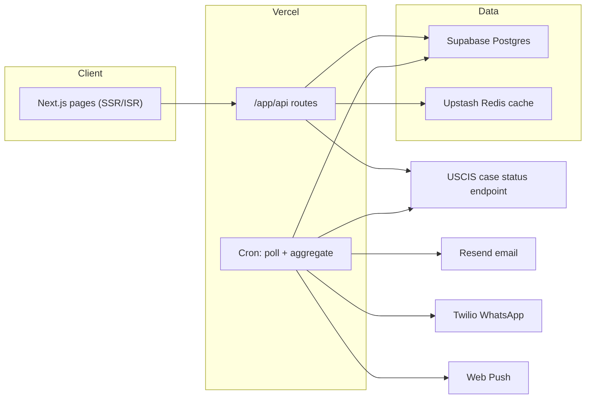

# uscasestatus.com — Product Plan & Build Roadmap

The complete plan for building a USCIS case tracker that beats MyCasesHub on user experience, trust, and speed-to-answer. Companion doc: [mycaseshub-inventory.md](./mycaseshub-inventory.md) (full competitive teardown).

---

## 1. Vision & positioning

**One sentence:** The fastest, clearest answer to "what's happening with my immigration case, and what happens next?" — in English and Spanish, on any device, free.

**Who it's for:** Applicants and their families waiting on USCIS. They are anxious, check obsessively, often not native English speakers, and mostly on phones. The product wins by reducing anxiety, not by dumping data.

### How we beat MyCasesHub

| MyCasesHub weakness | Our answer |
|---|---|
| Vue SPA — blank boot screen, poor SEO, slow first paint | Next.js server-rendered pages; status pages and trackers are static/ISR and load instantly; every page indexable |
| Data-dense, jargon-heavy UI built for power users | Plain-English-first: every status translated into "what this means" + "what to do next", written with real immigration expertise |
| Daily status refresh only | **Live check against USCIS at lookup time** — always the freshest answer — plus scheduled re-checks for tracked cases |
| Spanish is an afterthought (`?lang=es` toggle) | Bilingual EN/ES as first-class routes (`/es/...`), fully translated content, hreflang done right |
| Alerts limited, gated by plan (Free = 1 alert) | Generous alerts: email + web push free; WhatsApp — which our audience actually uses — as the paid hook |
| Ads on free tier | No ads, ever. Cleaner experience, monetize via Pro |
| No human expertise in the product | Expert-written explainers, "what to do next" guidance, RFE survival guides — content nobody else can fake |
| Cluttered nav (games, community, H-1B hub, PERM all mixed in) | Ruthless focus: case answer first; adjacent tools added only when core is loved |

**Positioning line:** "Check your USCIS case status — and actually understand it."

---

## 2. Design & UX principles

Per the design system in [.cursorrules](../.cursorrules):

- Teal `#0F6E56` primary (light fill `#E1F5EE`, dark text `#085041`), `#FAFAFA` background, Inter font
- Status colors: amber = pending, green = approved, red = denied/RFE
- Flat, clean: 0.5px borders, 8/12px radii, no gradients or shadows
- **Mobile-first** — every screen designed at 375px first
- **Answer in one screen** — receipt in, answer out, no login wall, no layout shift
- **Never raw USCIS text alone** — always paired with the plain-English explanation
- **Loading and error states designed, not defaulted** — skeletons, friendly retry, USCIS-down banner

---

## 3. The product, screen by screen

### 3.1 Home (`/`)

The entire above-the-fold is one job: a large receipt-number input.

- Auto-formatting input (uppercase, 3-letter prefix + 10 digits, inline validation with the 13 valid prefixes)
- "Check status" button; result loads on the same flow with no page reload feel
- Below fold: how it works (3 steps), supported forms grid, trust strip (free, no account needed, not affiliated with USCIS), FAQ (with FAQ JSON-LD)
- ES toggle in header; `/es` mirrors everything

### 3.2 Case result (`/case/[receipt]`)

The money page. Server-fetched live from USCIS, streamed fast.

1. **Status card** — big status name, color-coded, form type auto-detected from USCIS text, "checked just now" timestamp, receipt shown formatted
2. **Plain English** — 2–3 sentences: what this status actually means (from `data/status-explanations.json`, expert-written)
3. **What to do next** — concrete guidance: wait / respond by deadline / call USCIS / see a lawyer
4. **Timeline** — vertical stepper of the typical path for this form (received → biometrics → review → interview → decision) with the current step highlighted; known history events plotted once we have them
5. **Processing time context** — "Cases like yours (I-765 at this service center) typically take X–Y months. You appear to be ~Z months in." (from USCIS published times in `data/processing-times.json`; upgraded to our own data in Phase 4)
6. **Track this case** — email input inline (no account needed): "We'll email you the moment this changes." Web push opt-in one tap. WhatsApp teased for Pro
7. Share link, print-friendly, ES version

### 3.3 Dashboard (`/dashboard`)

For signed-in users (magic link — no passwords).

- Card per tracked case: status color strip, form, receipt, last change, sparkline of days-in-status
- Add case, nickname cases ("Mom's I-130"), archive
- Alert channel toggles per case (email / push / WhatsApp)
- Change feed: reverse-chron list of every status change we've caught, per case

### 3.4 Status explainer library (`/status/[form]/[status]`)

The SEO engine — the pages MyCasesHub ranks with, done better.

- One page per form × status (start: 8 forms × ~14 statuses ≈ 100+ pages)
- Expert-written: what it means, is it good news, typical time in this status, what to do, what usually comes next, common mistakes, related statuses
- Static/ISR, bilingual, FAQ schema, interlinked with form trackers
- Inline receipt input on every page → funnels to the result page

### 3.5 Form tracker landing pages (`/[form]-tracker`)

`/i485-tracker`, `/i765-tracker`, `/i130-tracker`, `/i140-tracker`, `/n400-tracker`, `/i90-tracker`, `/i131-tracker`, plus intent pages `/green-card-tracker`, `/work-permit-tracker`, `/citizenship-tracker`, `/daca-tracker`, `/h4-ead-tracker`.

Each: receipt input, form-specific timeline visual, current published processing times, top statuses for that form linked to explainers, form-specific FAQ.

### 3.6 Processing times (`/processing-times`)

- Pick form + service center → published USCIS range, visualized (Recharts)
- "Where am I?" — enter filing date, see position on the range bar
- Per-form pages `/processing-times/[form]` for SEO

### 3.7 Insights (`/insights`) — Phase 4+

Built on our own accumulated data, mobile-first and human-readable:

- Daily USCIS activity (approvals/denials/RFEs per day, stacked bars)
- Approvals feed ("approved today, filed 2026-01 at NBC — 6.2 months")
- Backlog by filing month per form
- Weekly trend summaries in sentences, not just charts
- Receipt-number anatomy explainer

### 3.8 Nearby cases (on the result page) — Phase 4+

Our version of their headline feature: "Of 340 cases filed near yours at the same center: 41% approved (median 5.8 months), 52% pending, 4% RFE. Your case is at the 62nd percentile of waiting." One paragraph + one horizontal distribution bar. Depth on tap, not by default.

### 3.9 Account & billing (`/account`, `/pricing`) — Phase 5

Free forever: unlimited lookups, 3 tracked cases, email + push alerts, all explainers, processing times.
**Pro — $4.99/mo or $39/yr** (undercut MyCasesHub Lite, out-value their Premium):

- 25 tracked cases
- WhatsApp alerts
- Nearby-case analysis expanded + percentile position
- Case weather report (weekly personal email digest: what moved for cases like yours)
- Priority re-check frequency (4x/day vs daily)

Billing via Stripe (Checkout + customer portal). No ads on any tier.

---

## 4. Data strategy (the moat, built honestly)

MyCasesHub's moat is a 10M-record corpus. We build ours progressively, starting from what users give us:

1. **Phase 1** — every public lookup is (anonymously) recorded: receipt prefix block, form, status, timestamp. The product itself harvests the corpus.
2. **Phase 2** — tracked cases are polled on schedule (Vercel cron), producing longitudinal history: status A → status B with exact dates. This transition data is the raw material for timelines and predictions.
3. **Phase 3** — neighbor sampling: for each tracked case, periodically poll a sample of nearby receipt numbers (same center, adjacent sequence) at a polite rate (throttled, cached, jittered) to grow context around real users.
4. **Phase 4** — aggregates roll up nightly into `stats_*` tables powering nearby analysis, backlog, activity charts, and forecasts.

Rules: throttle hard, cache in Upstash Redis (dedupe identical lookups for 30–60 min), respect the endpoint, store no personal data — receipts and statuses only.

---

## 5. Architecture

Stack (already installed or per repo conventions): Next.js App Router + TypeScript + Tailwind, Supabase (Postgres + magic-link auth), Resend (email), Upstash Redis (cache + rate limit), Vercel (hosting + cron), Recharts, next-intl (EN/ES), Stripe (Phase 5), Twilio WhatsApp (Phase 5).

### Core tables (Supabase)

- `cases` — receipt, form_type, last_status, last_checked, history (jsonb), created_at
- `case_events` — receipt, from_status, to_status, observed_at (the longitudinal gold)
- `tracked_cases` — user_id/email, receipt, nickname, channels (jsonb), confirmed
- `lookups` — anonymized lookup log (receipt block, form, status, ts) feeding the corpus
- `stats_daily`, `stats_backlog`, `stats_nearby` — nightly aggregates (Phase 4)

### Key API routes (all `{ data, error }`, all rate-limited via Upstash)

- `POST /api/check` — validate receipt → Redis cache → live USCIS fetch → parse → persist → return status + explanation + timeline
- `POST /api/track` — save case + channel, send confirm email
- `GET /api/stats/nearby`, `GET /api/stats/activity` (Phase 4)
- `POST /api/stripe/webhook` (Phase 5)

---

## 6. Build phases

### Phase 0 — Foundation (repo currently a bare scaffold)

- Design system into Tailwind config + `globals.css` (teal palette, Inter via next/font, radii, borders)
- Base layout: header (logo, language toggle, sign-in), footer (disclaimer: not affiliated with USCIS, not legal advice)
- next-intl wired: `/` EN, `/es` ES, all UI strings in message catalogs from day one
- Core components: `ReceiptInput`, `StatusBadge`, `Card`, `Skeleton`, `Callout`
- Supabase client helpers (`lib/supabase`), Upstash rate limiter (`lib/ratelimit`)
- `data/forms.json` (15 forms), receipt validation util + tests

**Done when:** styled bilingual shell deploys on Vercel at uscasestatus.com.

### Phase 1 — The answer machine (core MVP)

- `lib/uscis.ts`: POST to USCIS endpoint, parse status from HTML, classify into canonical status enum, detect form type; handle errors (invalid receipt, USCIS down)
- `data/status-explanations.json`: every USCIS status message → plain_english, what_to_do, is_positive — **written by you** (EN + ES). This is the expertise moat; budget real time for it
- `POST /api/check` with Redis caching + rate limiting
- Home page + case result page (status card, plain English, what-to-do, typical timeline stepper, processing-time context from `data/processing-times.json`)
- Anonymized lookup logging into `lookups`
- SEO base: metadata, OG images, sitemap, robots

**Done when:** anyone can enter a receipt and get a live, explained, bilingual answer in under 3 seconds.

### Phase 2 — Tracking & alerts (the retention loop)

- Track-by-email on the result page (no account): confirm link via Resend, unsubscribe link in every email
- Web push (VAPID) opt-in
- Vercel cron (daily; hourly window for recently-changed cases): re-check tracked cases, write `case_events`, fire alerts on change
- Beautiful status-change email: old → new, plain English, what to do next, link back
- Magic-link auth (Supabase) + `/dashboard`: case cards, nicknames, per-case channels, change feed
- Free-tier cap: 3 tracked cases

**Done when:** a user is emailed within the cron window of their status changing, and manages cases from the dashboard.

### Phase 3 — SEO & content engine (traffic)

- Status explainer library: ~100+ `/status/[form]/[status]` pages, expert-written, bilingual, FAQ schema, ISR
- 12 form-tracker landing pages
- `/processing-times` + per-form pages
- Receipt-number anatomy page
- `llms.txt`, full sitemap index, hreflang pairs
- Analytics (Vercel Analytics) + Search Console wired

**Done when:** the content surface is live and indexed; organic impressions trending up.

### Phase 4 — Data intelligence (the moat compounds)

- Neighbor sampling cron (polite, jittered) around tracked cases
- Nightly aggregation into `stats_*`
- Result page gains: nearby-case paragraph + distribution bar, percentile position, backlog context
- `/insights`: daily activity chart, approvals feed, backlog by filing month, weekly plain-language trend summary
- Simple forecast: "cases like yours filed the same month are X% decided; at current pace yours reaches decision ~Month"

**Done when:** the result page answers "how long for cases LIKE mine" from our own data, and insights pages are live.

### Phase 5 — Monetization & WhatsApp

- Stripe Checkout + webhook + customer portal; `plans` on user profile; entitlement checks (tracked-case caps, channels, analysis depth)
- Twilio WhatsApp alerts (Pro)
- Weekly personal digest email (Pro)
- `/pricing` page; upgrade prompts only where limits are actually hit (never nag)

**Done when:** first paying subscriber; free tier still feels generous.

### Phase 6 — Expansion (only after core is loved)

Ordered by leverage, shipped one at a time:

1. **Weekly per-form trend briefs** (`/reports/[form]`) — auto-generated from `stats_*` with editorial templates; huge SEO surface
2. **Visa bulletin tracker** — bulletin viewer + "is my priority date current?" checker tied to tracked cases
3. **my.uscis.gov JSON decoder** — paste API JSON → decoded timeline (power-user + SEO play)
4. **Law-firm tier** — bulk CSV import, shared workspace, per-seat pricing (only with validated demand from Pro users)
5. **Chrome extension** — one-click check from USCIS pages

---

## 7. Success metrics

| Phase | North star |
|---|---|
| 1 | Lookups/day; result page < 3s p75 |
| 2 | Tracked cases; alert open rate > 60% |
| 3 | Organic clicks/week; indexed pages |
| 4 | % of results showing nearby analysis; corpus size |
| 5 | MRR; free→Pro conversion ≥ 2% |

Guardrails: USCIS fetch error rate < 2%, zero personal data in the corpus, ES parity on every shipped page.

---

## 8. What we deliberately do NOT build (for now)

- Community forum (moderation cost, off-mission), games, H-1B/PERM data hub (different product; revisit after Phase 6), native mobile apps (PWA + push covers it), AI chatbot (canned expertise beats hallucinated answers in this domain).
